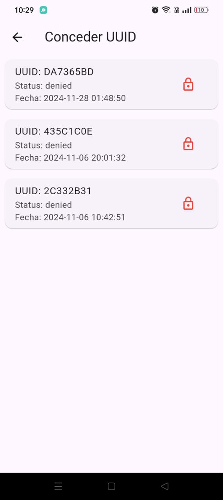

# QoriPunku Admin

## Visión General

**QoriPunku Admin** es la aplicación de administración remota que complementa al sistema de control de acceso QoriPunku (SecureGate). Esta herramienta permite gestionar todos los aspectos del sistema desde cualquier dispositivo, ofreciendo una interfaz intuitiva para monitorear visitantes, controlar permisos de acceso y configurar parámetros del sistema.

## Características Principales

- **Historial de Visitantes**: Visualización y gestión de fotografías capturadas durante intentos de acceso
- **Control de Accesos**: Administración de permisos para tarjetas RFID registradas en el sistema
- **Configuración Remota**: Actualización de parámetros críticos sin necesidad de acceder físicamente al sistema
- **Interfaz Intuitiva**: Diseño amigable y responsivo para facilitar la administración

## Tecnologías Utilizadas

  
  
  
  

## Interfaz Principal

QoriPunku Admin cuenta con una interfaz moderna que facilita la gestión del sistema de control de acceso:

  

## Funcionalidades Detalladas

### Control De Accesos

Permite visualizar todas las fotografías capturadas por el sistema QoriPunku durante intentos de acceso no autorizados.

- **Visualización Cronológica**: Ordenamiento por fecha y hora de los intentos de acceso
- **Detalles de Acceso**: Información sobre UUID de tarjeta, estado de aprobación y timestamp
- **Gestión de Registros**: Posibilidad de eliminar fotografías y registros no necesarios

  

### Control de UUIDS

Administra los permisos de las tarjetas RFID registradas en la base de datos del sistema.

- **Listado de Tarjetas**: Visualización de todas las tarjetas RFID registradas
- **Gestión de Permisos**: Otorgar o revocar acceso a tarjetas específicas
- **Información Detallada**: Historial de uso por tarjeta y datos asociados

  

### Configuración del Sistema

Permite modificar parámetros críticos del sistema QoriPunku sin necesidad de acceso físico.

- **Gestión de Administradores**: Actualización del número telefónico para notificaciones por WhatsApp
- **Seguridad**: Cambio de contraseña para acceso al panel de configuración físico
- **Parámetros de Sistema**: Ajuste de configuraciones generales y umbrales

  

## Arquitectura de la Aplicación

QoriPunku Admin sigue una arquitectura cliente-servidor:

- **Cliente Flutter**: Aplicación multiplataforma desarrollada con Flutter y Dart
- **Backend PHP**: API RESTful para la comunicación con la base de datos
- **Base de Datos MySQL**: Almacenamiento centralizado compartido con el sistema principal QoriPunku

La aplicación se comunica con el mismo servidor que utiliza el sistema QoriPunku, accediendo a la misma base de datos para mantener la coherencia de la información.

## Instalación

1. **Requisitos Previos**
   - Aplicación testeada en Android 12
   - Conexión a internet activa
   - Sistema QoriPunku correctamente configurado y operativo

2. **Instalación de la Aplicación**
   - Descargar el archivo APK desde la sección de releases
   - Permitir la instalación desde fuentes desconocidas en el dispositivo
   - Instalar la aplicación siguiendo las instrucciones en pantalla

3. **Configuración Inicial**
   - Abrir la aplicación e introducir la URL del servidor QoriPunku
   - Ingresar las credenciales de administrador (usuario: admin, contraseña: 1234)
   - Verificar la conectividad con el sistema

## Flujo de Trabajo

1. **Monitoreo de Accesos**
   - Revisar manualmente el historial de intentos de acceso
   - El administrador puede revisar las fotografías y detalles en cualquier momento
   - Se puede eliminar fotografías obsoletas o innecesarias

2. **Gestión de Permisos**
   - Revisar la lista de tarjetas RFID registradas
   - Activar o desactivar permisos para tarjetas específicas
   - Las modificaciones surten efecto inmediatamente en el sistema

3. **Actualización de Configuraciones**
   - Modificar parámetros según necesidades cambiantes
   - Los cambios se sincronizan automáticamente con el sistema QoriPunku

## Licencia

Este proyecto está bajo la Licencia MIT - consulta el archivo [LICENSE](LICENSE.md) para más detalles.

## Contacto

Si tienes preguntas o sugerencias, no dudes en contactarme :)

---

  Desarrollado con orgullo en Perú, complementando al sistema QoriPunku.

